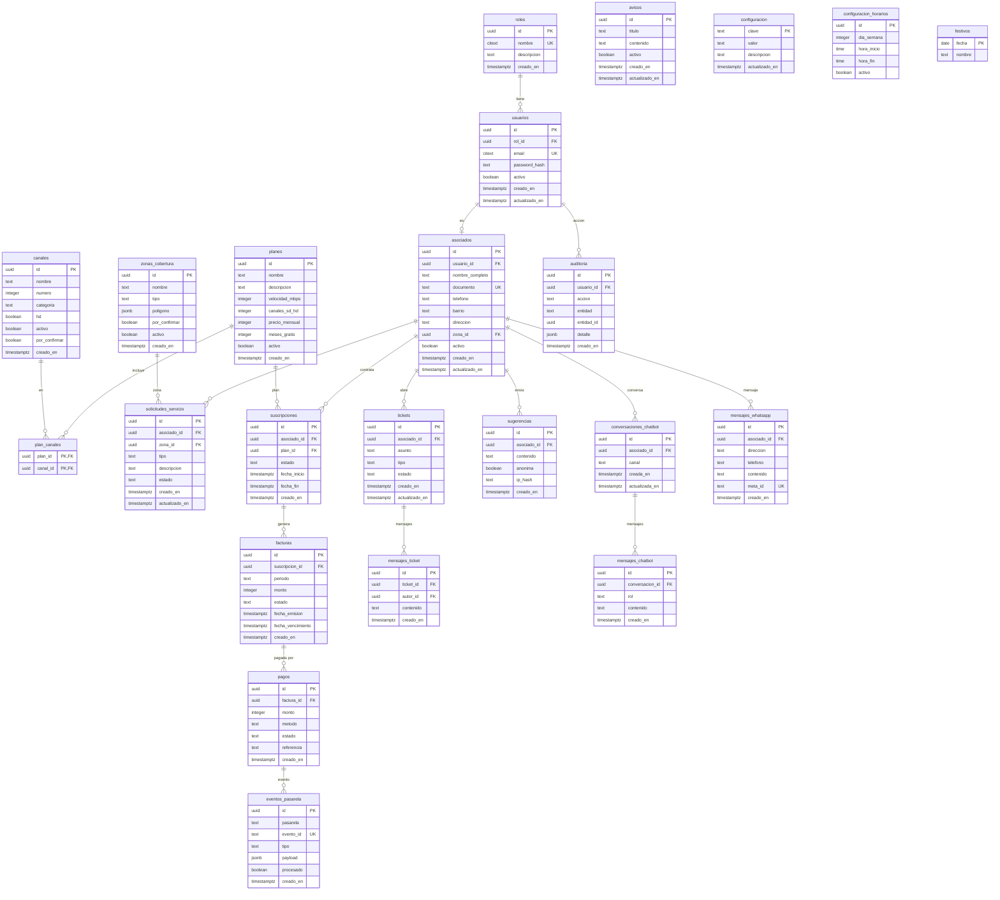

# ER — Antena Parabólica Bajo Tigui

```mermaid
erDiagram
    roles {
        uuid id PK
        citext nombre UK
        text descripcion
        timestamptz creado_en
    }
    usuarios {
        uuid id PK
        uuid rol_id FK
        citext email UK
        text password_hash
        boolean activo
        timestamptz creado_en
        timestamptz actualizado_en
    }
    asociados {
        uuid id PK
        uuid usuario_id FK
        text nombre_completo
        text documento UK
        text telefono
        text barrio
        text direccion
        uuid zona_id FK
        boolean activo
        timestamptz creado_en
        timestamptz actualizado_en
    }
    planes {
        uuid id PK
        text nombre
        text descripcion
        integer velocidad_mbps
        integer canales_sd_hd
        integer precio_mensual
        integer meses_gratis
        boolean activo
        timestamptz creado_en
    }
    canales {
        uuid id PK
        text nombre
        integer numero
        text categoria
        boolean hd
        boolean activo
        boolean por_confirmar
        timestamptz creado_en
    }
    plan_canales {
        uuid plan_id PK,FK
        uuid canal_id PK,FK
    }
    zonas_cobertura {
        uuid id PK
        text nombre
        text tipo
        jsonb poligono
        boolean por_confirmar
        boolean activo
        timestamptz creado_en
    }
    solicitudes_servicio {
        uuid id PK
        uuid asociado_id FK
        uuid zona_id FK
        text tipo
        text descripcion
        text estado
        timestamptz creado_en
        timestamptz actualizado_en
    }
    suscripciones {
        uuid id PK
        uuid asociado_id FK
        uuid plan_id FK
        text estado
        timestamptz fecha_inicio
        timestamptz fecha_fin
        timestamptz creado_en
    }
    facturas {
        uuid id PK
        uuid suscripcion_id FK
        text periodo
        integer monto
        text estado
        timestamptz fecha_emision
        timestamptz fecha_vencimiento
        timestamptz creado_en
    }
    pagos {
        uuid id PK
        uuid factura_id FK
        integer monto
        text metodo
        text estado
        text referencia
        timestamptz creado_en
    }
    eventos_pasarela {
        uuid id PK
        text pasarela
        text evento_id UK
        text tipo
        jsonb payload
        boolean procesado
        timestamptz creado_en
    }
    tickets {
        uuid id PK
        uuid asociado_id FK
        text asunto
        text tipo
        text estado
        timestamptz creado_en
        timestamptz actualizado_en
    }
    mensajes_ticket {
        uuid id PK
        uuid ticket_id FK
        uuid autor_id FK
        text contenido
        timestamptz creado_en
    }
    sugerencias {
        uuid id PK
        uuid asociado_id FK
        text contenido
        boolean anonima
        text ip_hash
        timestamptz creado_en
    }
    conversaciones_chatbot {
        uuid id PK
        uuid asociado_id FK
        text canal
        timestamptz creada_en
        timestamptz actualizada_en
    }
    mensajes_chatbot {
        uuid id PK
        uuid conversacion_id FK
        text rol
        text contenido
        timestamptz creado_en
    }
    mensajes_whatsapp {
        uuid id PK
        uuid asociado_id FK
        text direccion
        text telefono
        text contenido
        text meta_id UK
        timestamptz creado_en
    }
    avisos {
        uuid id PK
        text titulo
        text contenido
        boolean activo
        timestamptz creado_en
        timestamptz actualizado_en
    }
    configuracion {
        text clave PK
        text valor
        text descripcion
        timestamptz actualizado_en
    }
    configuracion_horarios {
        uuid id PK
        integer dia_semana
        time hora_inicio
        time hora_fin
        boolean activo
    }
    festivos {
        date fecha PK
        text nombre
    }
    auditoria {
        uuid id PK
        uuid usuario_id FK
        text accion
        text entidad
        uuid entidad_id
        jsonb detalle
        timestamptz creado_en
    }

    roles ||--o{ usuarios : "tiene"
    usuarios ||--o| asociados : "es"
    planes ||--o{ plan_canales : "incluye"
    canales ||--o{ plan_canales : "en"
    asociados ||--o{ suscripciones : "contrata"
    planes ||--o{ suscripciones : "plan"
    suscripciones ||--o{ facturas : "genera"
    facturas ||--o{ pagos : "pagada por"
    pagos ||--o{ eventos_pasarela : "evento"
    asociados ||--o{ solicitudes_servicio : "solicita"
    zonas_cobertura ||--o{ solicitudes_servicio : "zona"
    asociados ||--o{ tickets : "abre"
    tickets ||--o{ mensajes_ticket : "mensajes"
    asociados ||--o{ sugerencias : "envia"
    asociados ||--o{ conversaciones_chatbot : "conversa"
    conversaciones_chatbot ||--o{ mensajes_chatbot : "mensajes"
    asociados ||--o{ mensajes_whatsapp : "mensaje"
    usuarios ||--o{ auditoria : "accion"
```